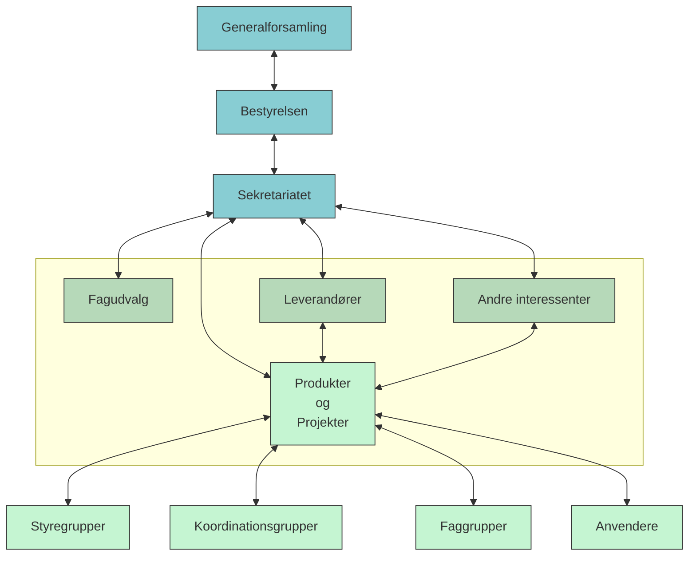
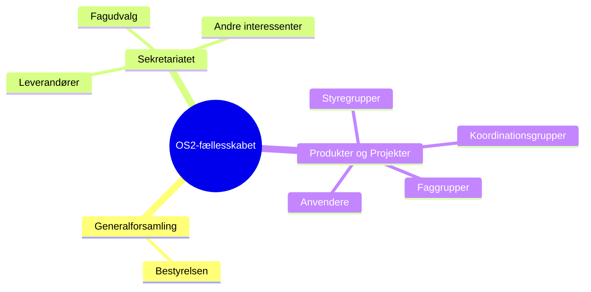

# Organisation og roller

Dette afsnit beskriver OS2’s organisatoriske struktur, roller og samarbejdsrelationer – fra bestyrelsen og sekretariatet til produktfællesskaberne og deres koordinatorer.  
Her gives et indblik i, hvordan OS2 og sekretariatet er organiseret, hvem der har hvilke roller, og hvordan vi samarbejder internt og med fællesskabets aktører.

## OS2’s organisering {#organisering}

**OS2-fællesskabet** er organiseret som en forening med:
- En **bestyrelse**, som varetager det strategiske og overordnede ansvar. Medlemmer til bestyrelsen vælges af foreningens generalforsamling.
- Et **sekretariat**, som understøtter foreningens arbejde og fællesskaberne omkring de enkelte projekter og produkter. Sekretariatet fungerer som et fælles omdrejningspunkt og understøtter de mange produktfællesskaber, der drives decentralt af kommuner og andre offentlige aktører.
- En række **produkt- og projektfællesskaber**, som udvikler, drifter og forvalter de enkelte løsninger.
- Medlemskommuner og øvrige offentlige aktører, som bidrager med behov, prioritering og forankring.
- Private leverandører som har tilkendegivet, at de vil levere på open source-betingelser samt overdrage ejerskabet til resultater til OS2.

### Organisationsdiagram

Her kan indsættes et simpelt **diagram** (f.eks. i Mermaid-format eller som billede), som viser sammenhængen mellem:
- Bestyrelse  
- Sekretariat  
- Produktfællesskaber  
- Medlemmer  
- Eksterne samarbejdspartnere (leverandører, ITK, KL m.fl.)

#### Klassisk organisationsdiagram

#### Organisk fremstilling af organisationen

## Roller og ansvar {#roller}

Sekretariatet består af flere funktioner med hver sit fokusområde.  
Her finder du kort beskrivelse og link til de detaljerede funktionsbeskrivelser.

| Rolle | Hovedopgaver | Reference |
|-------|---------------|------------|
| **Sekretariatschef** | Overordnet ledelse, strategi, kontakt til bestyrelse og OS2-fællesskab | [Funktionsbeskrivelse](role_descriptions/chief_executive_and_secretary) |
| **Produktkonsulent** | Rådgivning, projektstøtte, kvalitet og dokumentation | [Funktionsbeskrivelse](role_descriptions/product_advisor) |
| **Enterprise Arkitekt** | Teknisk rådgivning, standardisering og arkitekturprincipper | [Funktionsbeskrivelse](role_descriptions/enterprise_architect) |
| **Kommunikationsmedarbejder** | Intern og ekstern kommunikation, nyhedsbreve, hjemmeside | [Funktionsbeskrivelse](role_descriptions/communications_officer) |
| **Forretningskoordinator** | Processer, drift og støttefunktioner | [Funktionsbeskrivelse]() |
| **Produktkoordinator** | Koordination, governance og fremdrift i et OS2-produkt | [Funktionsbeskrivelse](role_descriptions/product_coordinator) |
| **Programleder** | Produktledelse, prioritering og koordinering af udvikling i et OS2-produkt | [Funktionsbeskrivelse](role_descriptions/program_manager) |

> Alle medarbejdere deler et fælles ansvar for at styrke samarbejdet i OS2 og sikre, at sekretariatet arbejder ud fra fællesskabets værdier om åbenhed, samarbejde og ejerskab.

## Samarbejde med bestyrelsen, myndigheder og medlemmer {#samarbejde}

Sekretariatet understøtter **bestyrelsen** ved at:
- Forberede beslutningsoplæg og sikre opfølgning.  
- Gøre bestyrelsens beslutninger operationelle på tværs af projekter og produkter.  
- Bidrage med faglig rådgivning om governance, strategi og prioritering.

Sekretariatet samarbejder med **myndigheder og medlemmer** ved at:
- Rådgive om deltagelse i OS2’s projekter og produkter.  
- Understøtte onboarding og medlemsservice.  
- Sikre tydelig kommunikation og videndeling mellem medlemmerne.

## Samarbejde med produktfællesskaber og produktkoordinatorer {#samarbejde2}

En central del af OS2-fællesskabet er de mange **projekt- og produktfællesskaber**, som udvikler, drifter og forvalter de enkelte løsninger i OS2.  
Hvert fællesskab har sit eget fokus og sin egen organisering, men arbejder inden for de fælles principper for governance og åbenhed, som er beskrevet i OS2’s rammer.

Sekretariatet **understøtter og koordinerer** produktfællesskaberne ved at:
- Bidrage med rådgivning om governance, drift og samarbejdsformer.  
- Sikre, at nye og eksisterende produkter anvender fælles standarder, licenser og processer.  
- Samle erfaringer og behov på tværs af produkter, så fællesskabet lærer af hinanden.  
- Tilbyde skabeloner, kommunikationskanaler og fælles procedurer for møder, dokumentation og beslutninger.

Produktfællesskaberne ledes typisk af en **produktkoordinator**, som er ansat i en myndighed, der anvender produktet.  
Typisk frikøbes en produktkoordinator et antal timer til at varetage opgaven – vi har eksempler på 1/5, 1/3, 1/2 og 1/1 årsværk.  
Produktkoordinatoren har ansvaret for at samle fællesskabet omkring produktet, facilitere dialogen mellem brugere, leverandører og sekretariatet samt sikre fremdrift i henhold til fællesskabets prioriteringer.  
Koordinatorrollen er en nøglefunktion, fordi den forbinder **sekretariatets fælles governance** med **den lokale forankring og ejerskab** i kommunerne.

Sekretariatet og produktkoordinatorerne arbejder tæt sammen om at:
- Afstemme behov og prioriteringer.  
- Udvikle og vedligeholde governance-dokumenter, budgetter og årshjul.  
- Skabe kontinuitet i samarbejdet mellem leverandører og produktfællesskaber.  
- Sikre, at beslutninger i produktfællesskaberne hænger sammen med OS2’s overordnede strategi og formål.

> Produktkoordinatorerne er dermed en del af OS2’s udvidede organisation – de fungerer som bro mellem sekretariatet, brugerne og de enkelte produktfællesskaber.

## Kontaktflader og samarbejdspartnere {#kontaktflader}

Sekretariatet samarbejder med en række aktører uden for OS2-fællesskabet, som bidrager til fælles udvikling og kvalitet:

| Samarbejdspartner | Rolle i OS2-sammenhæng |
|--------------------|------------------------|
| **ITK, Aarhus Kommune** | Sekretariatets organisatoriske base. Støtter med fagligt miljø, HR og økonomi. |
| **Produktkoordinatorer (kommunale)** | Sikrer lokal forankring, prioritering og koordinering i de enkelte produktfællesskaber. |
| **Leverandører** | Udvikler og vedligeholder OS2-produkter i overensstemmelse med open source-principper. |
| **KL, KOMBIT, Digitaliseringsstyrelsen** | Strategiske samarbejdspartnere i offentlig digitalisering. |
| **Andre netværk** | Fx OSPO Alliance, Interoperable Europe og internationale open source-partnerskaber. |

---

> OS2’s organisering bygger på princippet om **fælles ansvar og decentral handlefrihed**.  
> Fællesskabets styrke ligger i samspillet mellem sekretariatets koordinering, produktfællesskabernes initiativ og kommunernes ejerskab.

## Relaterede dokumenter

- [OS2 organisering – Strand & Donslund rapport version 1.0](https://boks.os2.eu/s/Afco557gKpepLJa)
- [Kommissorium for OS2’s bestyrelse](https://boks.os2.eu/s/dKzT7k34m2sSTem)
- [Funktionsbeskrivelser for roller i OS2-sekretariatet]()
