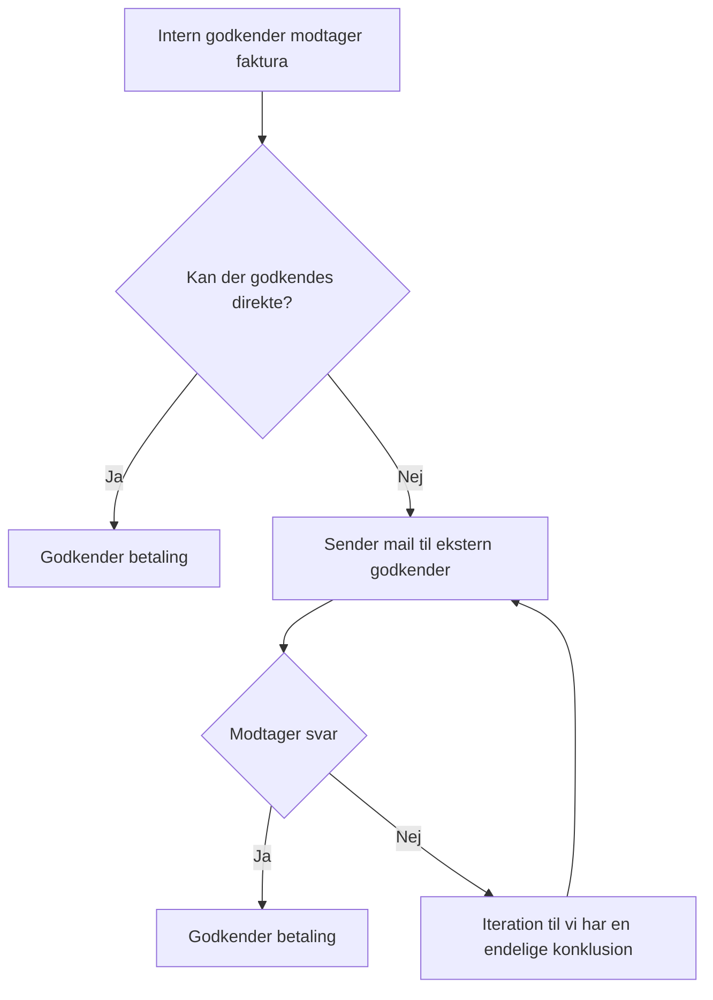

# Oversigt over hvem der godkender regninger

Følgende oversigt indeholder navn og kontaktoplysning på de personer som kontrollere økonomien i de enkelte produkter

| PSP-element   | Projektnavn       | Intern godkender                 | Ekstern godkender                             |
|---------------|-------------------|----------------------------------|-----------------------------------------------|
| XG-4300001222 | OS2kravmotor      | OS2-sekretariat administration [faktura@os2.eu](mailto:faktura@os2.eu)       | Line Lynggaard Sørensen [lils@syddjurs.dk](mailto:lils@syddjurs.dk)      |
| XG-4300001223 | OS2rollekatalog   | OS2-sekretariat administration [faktura@os2.eu](mailto:faktura@os2.eu)       | Mette Valbjørn [metva@favrskov.dk](mailto:metva@favrskov.dk)              |
| XG-4300001224 | OS2autoproces     | OS2-sekretariat administration [faktura@os2.eu](mailto:faktura@os2.eu)       | Jette Meller Thomsen [jemth@syddjurs.dk](mailto:jemth@syddjurs.dk)|
| XG-4300001225 | OS2indberetning   | OS2-sekretariat administration [faktura@os2.eu](mailto:faktura@os2.eu)       | Katrine Kjærgaard Bach [katrine.k.bach@rksk.dk](mailto:katrine.k.bach@rksk.dk) |
| XG-4300001226 | OS2valghalla      | Lisbeth Lorentzen [liwl@aarhus.dk](mailto:liwl@aarhus.dk) | OS2-sekretariat administration [faktura@os2.eu](mailto:faktura@os2.eu) |
| XG-4300001227 | OS2faktor         | OS2-sekretariat administration [faktura@os2.eu](mailto:faktura@os2.eu)       | Jens Andreas Kristensen [dres@rksk.dk](mailto:dres@rksk.dk), Mads Larsen [5mal@ishoj.dk](mailto:5mal@ishoj.dk)|
| XG-4300001228 | OS2udoglær        | Mie Frydensbjerg [mif@aarhus.dk](mailto:mif@aarhus.dk)   | OS2-sekretariat administration [faktura@os2.eu](mailto:faktura@os2.eu) |
| XG-4300001230 | OS2flytjord       | Mette Hansen [meeh@aarhus.dk](mailto:meeh@aarhus.dk)      | OS2-sekretariat administration [faktura@os2.eu](mailto:faktura@os2.eu) |
| XG-4300001231 | OS2kle            | OS2-sekretariat administration [faktura@os2.eu](mailto:faktura@os2.eu)       | Jon Badstue Pedersen [jbp@syddjurs.dk](mailto:jbp@syddjurs.dk) |
| XG-4300001232 | OS2sync           | OS2-sekretariat administration [faktura@os2.eu](mailto:faktura@os2.eu)       |  |
| XG-4300001233 | OS2forms          | Anna-Lis Berg [besoan@aarhus.dk](mailto:besoan@aarhus.dk)   | OS2-sekretariat administration [faktura@os2.eu](mailto:faktura@os2.eu) |
| XG-4300001234 | OS2borgerPC       | Anna-Lis Berg [besoan@aarhus.dk](mailto:besoan@aarhus.dk)   | OS2-sekretariat administration [faktura@os2.eu](mailto:faktura@os2.eu) |
| XG-4300001235 | OS2display        | Anna-Lis Berg [besoan@aarhus.dk](mailto:besoan@aarhus.dk)   | OS2-sekretariat administration [faktura@os2.eu](mailto:faktura@os2.eu) |
| XG-4300001236 | OS2iot            | Lisbeth Lorentzen [liwl@aarhus.dk](mailto:liwl@aarhus.dk) | OS2-sekretariat administration [faktura@os2.eu](mailto:faktura@os2.eu) |
| XG-4300001238 | OS2mo             | OS2-sekretariat administration [faktura@os2.eu](mailto:faktura@os2.eu)       | Mikael Olsen [miol@balk.dk](mailto:miol@balk.dk)                     |
| XG-4300001239 | OS2kitos          | OS2-sekretariat administration [faktura@os2.eu](mailto:faktura@os2.eu)       | Mikael Olsen [miol@balk.dk](mailto:miol@balk.dk)                     |
| XG-4300001240 | OS2skoledata      | OS2-sekretariat administration [faktura@os2.eu](mailto:faktura@os2.eu)       | Lars Lyngsøe Højberg [ilahn@rebild.dk](mailto:ilahn@rebild.dk)          |
| XG-4300001241 | OS2sofd           | OS2-sekretariat administration [faktura@os2.eu](mailto:faktura@os2.eu)       | Erling Haunstrup Poulsen [ehp@syddjurs.dk](mailto:ehp@syddjurs.dk)      |
| XG-4300001242 | OS2compliance     | OS2-sekretariat administration [faktura@os2.eu](mailto:faktura@os2.eu)       | Nina Birthe Sørensen [nina@nibis.dk](mailto:nina@nibis.dk)            |
| XG-4300001243 | OS2skadesøkonomi  | OS2-sekretariat administration [faktura@os2.eu](mailto:faktura@os2.eu)       | Jesper Gaardboe Jensen [jgje@erhvervshusfyn.dk](mailto:jgje@erhvervshusfyn.dk) |
| XG-4300001244 | OS2korrespondance | OS2-sekretariat administration [faktura@os2.eu](mailto:faktura@os2.eu)       | Michelle Juhl [mjbp@syddjurs.dk](mailto:mjbp@syddjurs.dk)                |
| XG-4300001245 | OS2nectar         | OS2-sekretariat administration [faktura@os2.eu](mailto:faktura@os2.eu)       | Jens Kjellerup [jeh2@balk.dk](mailto:jeh2@balk.dk)                   |
| XG-4300001246 | OS2skole          | OS2-sekretariat administration [faktura@os2.eu](mailto:faktura@os2.eu)       | Henrik Bojsen [heboj@syddjurs.dk](mailto:heboj@syddjurs.dk)               |
| XG-4300001247 | OS2fleetoptimiser | Sofie Buhl [sofbu@aarhus.dk](mailto:sofbu@aarhus.dk)       | OS2-sekretariat administration [faktura@os2.eu](mailto:faktura@os2.eu) |
| XG-4300001248 | OS2planCO2        | OS2-sekretariat administration [faktura@os2.eu](mailto:faktura@os2.eu)       | Ingen                                         |
| XG-4300001249 | OS2ai             | Signe Marie Skovby Ahm [masia@aarhus.dk](mailto:masia@aarhus.dk) | OS2-sekretariat administration [faktura@os2.eu](mailto:faktura@os2.eu) |
| XG-4300001250 | OS2connector      | Sofie Buhl [sofbu@aarhus.dk](mailto:sofbu@aarhus.dk)       | OS2-sekretariat administration [faktura@os2.eu](mailto:faktura@os2.eu) |
| XG-4300001251 | OS2opendatadk      | Agnete Sig Petersen [pags@aarhus.dk](mailto:pags@aarhus.dk)       | OS2-sekretariat administration [faktura@os2.eu](mailto:faktura@os2.eu) |
| XG-4300001252 | OS2aiheatcontrol      | OS2-sekretariat administration [faktura@os2.eu](mailto:faktura@os2.eu)       | Jesper Buchhardt [Jesper.Buchhardt@silkeborg.dk](mailto:Jesper.Buchhardt@silkeborg.dk) |

## Proces for godkendelse af faktura i OS2

