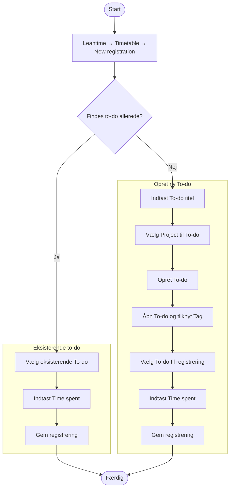

# Struktur for tidsregistrering

## Formål

Formålet med tidsregistrering i OS2-sekretariatet er at skabe **gennemsigtighed, læring og overblik** over, hvordan vores tid anvendes på tværs af produkter, fællesskab og drift. Systemet skal være enkelt at bruge, let at forstå og give meningsfuld rapportering.

## 1. Grundidé

Registrering sker i **[Leantime](https://itk-leantime.itkdev.dk/)** og bygger på princippet:

> **En registrering = ét projekt (hvor) + én opgave (hvad) + ét tag på opgaven (type) + tid (hvor længe).**

Systemet er designet til at:
- være **let at registrere i** (få valg og så vidt muligt foruddefinerede felter)
- **være forståeligt** (ensartede betegnelser)
- **understøtte rapportering** (på produkt, kategori og arbejdstype)

## 2. Grundprincipper

- **Projekt = hvor** du arbejder (OS2-projekt, OS2-produkt eller sekretariatsarbejde).  
- **Opgave (to-do) = hvad** du laver (kort titel på opgaven).  
- **Tag på opgaven = type** kategori for det du laver (tags beskrives længere nede).  
- **Tid = hvor længe** du har brugt (i kvarte timer).  

## 3. Projekter i OS2-sekretariatet

For at holde systemet overskueligt arbejder vi med et udgangspunkt af en fast og begrænset liste af projekter (hvor).  
Listen omfatter både OS2-produkter, OS2-projekter og sekretariatsarbejde.

### A. OS2-produkter og -projekter
Produkter, hvor sekretariatet har en aktiv rolle er oprettet som standard f.eks.:
- OS2valghalla  
- OS2iot  
- OS2ai  
- OS2opendata  
- OS2skole  

### B. Sekretariatsarbejde
Projektet bruges til langt de fleste opgaver sekretariatet udfører. Det er f.eks.:

- Generel støtte og rådgivning til OS2-produkter, hvor arbejdet ikke entydigt hører under ét specifikt produkt.
- Udarbejdelse af beslutningsoplæg, referater, strategisk sparring og opfølgning.
- Nyhedsbreve, hjemmeside, SoMe, oplæg, presse og events.
- Kontakt til medlemmer, onboarding, medlemsopfølgning, netværk og samarbejde.
- Samarbejde med KL, KOMBIT, EU, OSPO’er og fællesoffentlige initiativer.
- Kurser, konferencer, oplæg og intern læring.
- Økonomi, fakturaer, kontrakter, kontoplan, personale og daglige driftsopgaver.

### C. Større projekter og årlige aktiviteter
Projekter hvor det vurderes at det er hensigtsmæssigt at registrere opgaver og tid selvstændigt frem for på projektet til sekretariatsarbejde.

Det kan f.eks. være:
- Planlægning, forberedelse og afholdelse af OS2’s årsmøde og generalforsamling.
- Planlægning og gennemførelse af fællesskabsdage, leverandørmøder og samarbejdsevents.
- Udvikling og implementering af ny værktøjer.

## 4. Tags (kategorier for opgavetype)

De faste **tags** bruges til at klassificere opgaven (to-do) på tværs af projekter.  
Formålet er at sikre ensartet og konsistent brug af tags i tidsregistreringen.  
Hver registrering skal have ét primært arbejdstype-tag.

### Strategi & interessevaretagelse

**Bruges når:**  
Arbejdet handler om OS2’s overordnede retning, positionering eller strategiske påvirkning.

**Typiske situationer:**
- Udvikling af strategiske satsninger
- Dialog med KL, KOMBIT, Ministerier og Styrelser, EU, OSPO’er
- Udarbejdelse af strategiske notater og positioner
- Høringssvar og policy-arbejde

**Bruges ikke når:**  
Arbejdet vedrører konkret produktdrift eller almindelig bestyrelsesbetjening.

### Governance & bestyrelsesbetjening

**Bruges når:**  
Arbejdet vedrører formel styring, beslutningsgrundlag og rapportering.

**Typiske situationer:**
- Forberedelse af bestyrelsesmøder
- Udarbejdelse af beslutningsoplæg
- Porteføljeoverblik
- Udvikling af governance-modeller
- Generalforsamling

**Bruges ikke når:**  
Arbejdet er almindelig administration eller strategisk interessevaretagelse.

### Produkt-/projektstøtte (udvikling)

**Bruges når:**  
Arbejdet bidrager til fremdrift, udvikling eller forbedring af produkter eller projekter.

**Typiske situationer:**
- Projektmodning
- Udvikling af værktøjer og skabeloner
- Rådgivning om udvikling
- Udarbejdelse af dokumentation og best practice

**Bruges ikke når:**  
Arbejdet handler om stabil drift, møder eller opfølgning på eksisterende leverancer.

### Produkt-/projektstøtte (drift)

**Bruges når:**  
Arbejdet handler om stabilisering, koordinering og vedligehold af eksisterende produkter.

**Typiske situationer:**
- Styregrupper
- Koordinationsgrupper
- Leverandøropfølgning
- Incident-håndtering
- Løbende opfølgning

**Bruges ikke når:**  
Arbejdet udvikler nyt eller forbedrer strukturer.

### Kommunikation & synlighed

**Bruges når:**  
Arbejdet handler om formidling, synlighed og kommunikation.

**Typiske situationer:**
- Nyhedsbreve
- Artikler
- SoMe
- Oplæg
- Presse
- Produktkommunikation

**Bruges ikke når:**  
Arbejdet primært er strategisk eller governance.

### Fællesskab & relationer

**Bruges når:**  
Arbejdet handler om relationer, engagement og samarbejdskultur.

**Typiske situationer:**
- Medlemsdialog
- Onboarding
- Facilitering af netværk
- Konflikthåndtering
- Forventningsafstemning

**Bruges ikke når:**  
Arbejdet er ren produktdrift eller administration.

### Administration & intern drift

**Bruges når:**  
Arbejdet vedrører praktisk og administrativ understøttelse af sekretariatet.

**Typiske situationer:**
- Økonomi
- Fakturaer
- Kontrakter
- Medlemsdata
- Tidsregistrering
- Systemdrift

**Bruges ikke når:**  
Arbejdet er strategisk, relationelt eller udviklingsorienteret.

### Ledelse & personale

**Bruges når:**  
Arbejdet vedrører ledelse og organisering af medarbejdere.

**Typiske situationer:**
- 1:1 samtaler
- MUS
- Trivsel
- Prioritering og kapacitetsplanlægning
- Rekruttering
- Procesforbedring internt

**Bruges ikke når:**  
Arbejdet handler om produkter eller fællesskabet eksternt.

### Kompetenceudvikling & læring

**Bruges når:**  
Arbejdet primært har læring som formål.

**Typiske situationer:**
- Kurser
- Konferencer med læringsformål
- Faglig opdatering
- Intern videndeling

**Bruges ikke når:**  
Konferencen primært er repræsentation eller oplæg (så er det Kommunikation).

### Pause

**Bruges når:**  
Registrering af betalt pause (fx frokost), hvis den indgår i arbejdstiden.

**Bruges ikke når:**  
Der arbejdes aktivt under pausen.

### Fravær

**Bruges når:**  
Medarbejderen ikke udfører arbejde.

**Typiske situationer:**
- Ferie
- Sygdom
- Barn syg
- Afspadsering
- Barsel
- Korttidsfravær

### Møde – internt

**Bruges når:**  
Et internt møde ikke entydigt kan kategoriseres under en anden arbejdstype.

**Vigtig regel:**  
Hvis mødet har et klart formål (fx strategi, produktdrift eller governance), skal det registreres under den relevante arbejdstype – ikke her.

### Transport

**Bruges når:**  
Der transporteres uden at udføre aktivt arbejde.

**Bruges ikke når:**  
Transporttiden anvendes til aktivt arbejde (fx forberedelse i tog).

## 5. Registrering i Leantime

> Brug korte, sigende opgavetitler – f.eks. *“Udarbejde governance-rapport”* eller *“Forberede OS2-seminar”*.  
> Tilknyt altid et tag til opgaven.  
> Tværgående opgaver registreres som sekretariatsarbejde mens opgaver på specifikke projekter registreres her.  

## 6. Regler og gode vaner
- En registrering = ét projekt + én opgave + ét tag + tid.  
- Brug konsekvente navne for projekter (fx “OS2 valghalla” med mellemrum så det er søgbart).  
- Del tiden op, hvis en opgave dækker flere projekter.   
- Brug samme kategorisering på tværs af projekter og opgaver for at sikre sammenlignelig rapportering.
