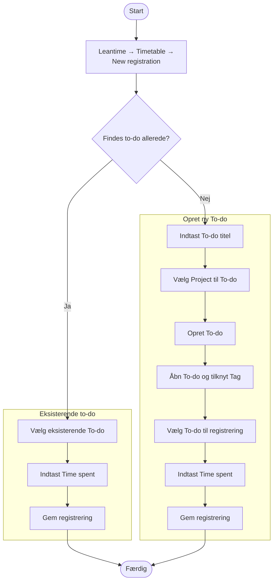

# Struktur for tidsregistrering

## Formål

Formålet med tidsregistrering i OS2-sekretariatet er at skabe **gennemsigtighed, læring og overblik** over, hvordan vores tid anvendes på tværs af produkter, fællesskab og drift. Systemet skal være enkelt at bruge, let at forstå og give meningsfuld rapportering.

## 1. Grundidé

Registrering sker i **[Leantime](https://itk-leantime.itkdev.dk/)** og bygger på princippet:

> **En registrering = ét projekt (hvor) + én opgave (hvad) + ét tag på opgaven (type) + tid (hvor længe).**

Systemet er designet til at:
- være **let at registrere i** (få valg og så vidt muligt foruddefinerede felter)
- **være forståeligt** (ensartede betegnelser)
- **understøtte rapportering** (på projekt og tag niveau)

## 2. Grundprincipper

- **Projekt = hvor** du arbejder (OS2-projekt, OS2-produkt eller sekretariatsarbejde).  
- **Opgave (to-do) = hvad** du laver (kort titel på opgaven).  
- **Tag på opgaven = type** kategori for det du laver (tags beskrives længere nede).  
- **Tid = hvor længe** du har brugt (i kvarte timer).  

## 3. Projekter i OS2-sekretariatet

For at holde systemet overskueligt arbejder vi med et udgangspunkt af en fast og begrænset liste af projekter (hvor).  
Listen omfatter både OS2-produkter, OS2-projekter og sekretariatsarbejde.

### A. OS2-produkter og -projekter
Produkter, hvor sekretariatet har en aktiv rolle er oprettet som standard f.eks.:
- OS2valghalla  
- OS2iot  
- OS2ai  
- OS2opendata  
- OS2skole 

Kontakt Rasmus for oprettelse af nye leantime projekter. Disse oprettes som en kopi af OS2 projektskabelon i leantime. 

### B. Sekretariatsarbejde
Projektet bruges til langt de fleste opgaver sekretariatet udfører. Det er f.eks.:

- Generel støtte og rådgivning til OS2-produkter, hvor arbejdet ikke entydigt hører under ét specifikt produkt.
- Udarbejdelse af beslutningsoplæg, referater, strategisk sparring og opfølgning.
- Nyhedsbreve, hjemmeside, SoMe, oplæg, presse og events.
- Kontakt til medlemmer, onboarding, medlemsopfølgning, netværk og samarbejde.
- Samarbejde med KL, KOMBIT, EU, OSPO’er og fællesoffentlige initiativer.
- Kurser, konferencer, oplæg og intern læring.
- Økonomi, fakturaer, kontrakter, kontoplan, personale og daglige driftsopgaver.

### C. Større projekter og årlige aktiviteter
Projekter hvor det vurderes at det er hensigtsmæssigt at registrere opgaver og tid selvstændigt frem for på projektet til sekretariatsarbejde.

Det kan f.eks. være:
- Planlægning, forberedelse og afholdelse af OS2’s årsmøde og generalforsamling.
- Planlægning og gennemførelse af fællesskabsdage, leverandørmøder og samarbejdsevents.
- Udvikling og implementering af ny værktøjer.

## 4. Tags (kategorier for opgavetype)

De faste **tags** bruges til at klassificere opgaven (to-do) på tværs af projekter.  
Formålet er at sikre ensartet og konsistent brug af tags i tidsregistreringen.  
Tags er vigtigt i forhold til rapporter da det disse udarbejdes med afsæt i Tags.
Hver registrering skal have ét primært arbejdstype-tag.

[Oversigt over tags samt formål](tags_tidsregistrering){: .btn }

## 5. Faste opgaver

Der er oprettet en række foruddefinerede opgaver i OS2s projektskabelon.  
Disse er allerede markeret med tag og kan anvendes til registrering af tid såfremt opgaver som løses matcher beskrivelsen.  

[Oversigt over faste opgaver oprettet i leantime samt formål](opgaver_tidsregistrering){: .btn }

## 6. Registrering i Leantime

```mermaid
flowchart TD
  %% Retning og start
  A([Start]) --> B[Leantime → Timetable →<br/>New registration]
  B --> C{Findes to-do allerede?}

  %% Gren: eksisterende to-do
  C -- Ja --> D
  subgraph S1 [Eksisterende to-do]
    D[ Vælg eksisterende To-do ]
    D --> E[ Indtast Time spent ]
    E --> G[ Gem registrering ]
  end

  %% Gren: opret ny to-do
  C -- Nej --> N1
  subgraph S2 [Opret ny To-do]
    N1[ Indtast To-do titel ]
    N1 --> P[ Vælg Project til To-do ]
    P --> O[ Opret To-do ]
    O --> T[ Åbn To-do og tilknyt Tag ]
    T --> R[ Vælg To-do til registrering ]
    R --> E2[ Indtast Time spent ]
    E2 --> H2[ Gem registrering ]
  end

  %% Fælles slut
  G --> Z([Færdig])
  H2 --> Z
```

> Brug korte, sigende opgavetitler – f.eks. *“Udarbejde governance-rapport”* eller *“Forberede OS2-seminar”*.  
> Tilknyt altid et tag til opgaven.  
> Tværgående opgaver registreres som sekretariatsarbejde mens opgaver på specifikke projekter registreres her.  

## 7. Regler og gode vaner
- En registrering = ét projekt + én opgave + ét tag + tid.  
- Brug konsekvente navne for projekter (fx “OS2 valghalla” med mellemrum så det er søgbart).  
- Del tiden op, hvis en opgave dækker flere projekter.   
- Brug samme kategorisering på tværs af projekter og opgaver for at sikre sammenlignelig rapportering.
