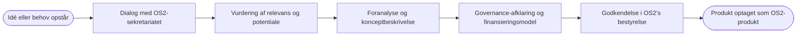

# Projekter, Produkter og fællesskaber
I afsnittes får du overblik over OS2’s produktportefølje og får beskrevet, hvordan sekretariatet understøtter fællesskaberne omkring hvert projekt og produkt.  
Afsnittet hjælper nye medarbejdere, produktkoordinatorer og samarbejdspartnere med at forstå, hvordan OS2’s projekter og produkter organiseres, driftes og videreudvikles i et fællesskab.

## OS2’s produktportefølje
OS2 består af en række fællesoffentlige open source-produkter, som udvikles, driftes og videreudvikles i samarbejde mellem offentlige myndigheder og private leverandører.  
Hvert produkt har sit eget fællesskab med deltagende myndigheder, leverandører og andre aktører.

Den samlede oversigt over OS2-produkter findes på:  
- [produkter.os2.eu](https://produkter.os2.eu)

Hvert produkt har (når fuldt etableret):
- en **styregruppe** med beslutningskompetence.  
- en **produktkoordinator** til at varetage den daglige koordinering.  
- en **koordinationsgruppe** til at støtte produktkoordinator med opgaveløsning, sparring og faglige input.  
- en **fælles ramme for styring** ([OS2s styringsmodel](https://governance.os2.eu)), der sikrer placering i OS2s produktnivauer samt åbenhed og kvalitet i udviklingen.

## Forskellen på projekt, produkt og fællesskab
For at arbejde effektivt i OS2 er det vigtigt at kende forskellen på de tre grundbegreber:

| Begreb | Definition | Formål |
|---------|-------------|--------|
| **Projekt** | En tidsbegrænset indsats med klart afgrænset mål og leverance. | At udvikle eller forbedre en løsning. Projekter kan føre til nye produkter. |
| **Produkt** | En færdig eller driftsmoden løsning, som vedligeholdes og videreudvikles i fællesskab. | At levere stabil funktionalitet, dokumentation og support til brugerne. |
| **Fællesskab** | Den gruppe af organisationer, personer og leverandører, der sammen ejer, bruger og udvikler et produkt. | At sikre engagement, ejerskab og fælles retning. |

💡 Et projekt skaber noget nyt.  
🔧 Et produkt holder det i live.  
🤝 Et fællesskab gør det stærkere.  

## Hvordan sekretariatet understøtter produkterne
Sekretariatets rolle er at sikre, at hvert produkt drives **kvalitetsbevidst, åbent og koordineret**.  
Det gør vi ved at tilbyde støtte, struktur og sparring i alle faser af produktets livscyklus.

**Sekretariatets hovedopgaver i produktunderstøttelse:**
- **Koordinering:** Bindeled mellem styregruppe, leverandører og produktkoordinatorer.  
- **Governance:** Sikre, at produktet følger OS2’s governance-model og anvender fælles skabeloner.  
- **Kvalitet:** Understøtte vedligeholdelse af dokumentation, licenser, sikkerhed og compliance.  
- **Facilitering:** Hjælpe produktfællesskaber med at skabe engagement, afholde møder og formidle resultater.  
- **Synlighed:** Bidrage til kommunikation, nyheder og opdateringer på os2.eu og sociale medier.  
- **Sparring:** Rådgive om strategi, udbud, økonomi og produktudvikling.

---

## Processen for nye produkter
Når nye idéer opstår, hjælper sekretariatet med at modne dem og vurdere, om de egner sig som OS2-produkter.

**Fra idé til OS2-optagelse:**

**Kriterier for OS2-optagelse:**
- Løsningen skal bygge på **open source** (OSI-godkendt licens).  
- Der skal være **offentligt ejerskab** og minimum to deltagende offentlige parter.  
- Der skal etableres **styregruppe og governance-setup**.  
- Produktet skal have **langtidsholdbar finansiering** og **engagement i fællesskabet**.

Sekretariatet bistår med vurdering, dokumentation og kontakt til bestyrelsen.

---

## Skabeloner og vejledninger
OS2 anvender en række fælles skabeloner for at sikre kvalitet og ensartethed i produktarbejdet.  
Alle skabeloner findes i GitHub og Nextcloud under *Værktøjskassen*.

| Dokument / skabelon | Formål | Placering |
|----------------------|---------|-----------|
| **Governance-checkliste** | Sikrer at produktet opfylder OS2’s kvalitets- og dokumentationskrav. | [governance_template.md](../governance_template.md) |
| **Tilslutningsaftale** | Regulerer deltagelse og økonomiske bidrag fra medlemmer i et produkt. | Nextcloud / Skabeloner |
| **FLOSS-aftale** | Juridisk ramme for open source-samarbejder. | [boks.os2.eu](https://boks.os2.eu) |
| **Kommunikationsskabeloner** | Giver ensartet formidling på tværs af produkter. | Nextcloud / Skabeloner |
| **Produkt- og projektskabeloner** | Understøtter dokumentation, budget og styring. | GitHub / Værktøjskasse |

---

## Sammenfatning
OS2’s produkter er fælleseje mellem offentlige myndigheder og udvikles i åbne fællesskaber.  
Sekretariatets rolle er at sikre, at produkterne drives professionelt, dokumenteres åbent og styres efter fælles standarder.  
Når vi arbejder efter samme governance, skabeloner og principper, kan vi dele, forbedre og genbruge – i bedste open source-ånd.
